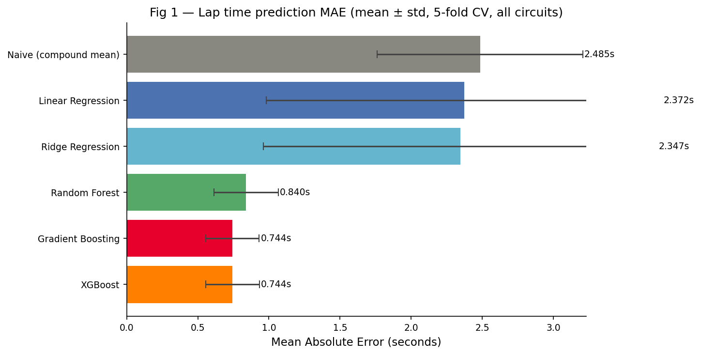

# Strategic Error Thresholds and Cross-Season Generalisation in Machine Learning Models for F1 Tyre Degradation Prediction

**Priyanshu Nayak • Vidita Nayak**

> Preprint: [ADD ARXIV LINK WHEN PUBLISHED]

---

## Overview

This repository contains the code and data for the paper *"Strategic Error Thresholds and Cross-Season Generalisation in Machine Learning Models for F1 Tyre Degradation Prediction"*.

We introduce the **strategic error threshold** — the minimum lap time prediction error at which a model's pit stop recommendation becomes unstable — and evaluate it across six circuits, six models, and three seasons of real Formula 1 race data.

**Key findings:**
- XGBoost and Gradient Boosting achieve equivalent within-season MAE of 0.744s (p = 0.914)
- Linear models perform very poorly under cross-season temporal evaluation (MAE > 900s at Monaco)
- At Hungarian Grand Prix, GBM's strategic error threshold is **0.75s** — within 0.01s of its measured prediction error
- Circuit type is the primary determinant of whether model choice matters strategically

---
## 📊 Key Results

### Model Performance (MAE)



---

## Repository structure

```
f1-strategy-thresholds/
├── f1_research.py        # Full research pipeline (3 experiments)
├── f1_app.py             # Streamlit strategy app (interactive)
├── f1_core.py            # ML engine used by the app
├── requirements.txt      # Python dependencies
├── results/
│   ├── summary.csv           # Experiment 1: within-season MAE per model
│   ├── cross_season.csv      # Experiment 2: cross-season generalisation MAE
│   ├── threshold.csv         # Experiment 3: strategy flip rates per sigma level
│   ├── sensitivity.csv       # Strategy recommendations per model per circuit
│   └── metrics.csv           # Full per-fold per-circuit metrics
└── README.md
```

---

## Setup

```bash
# Clone the repository
git clone https://github.com/[YOUR USERNAME]/f1-strategy-thresholds
cd f1-strategy-thresholds

# Install dependencies
pip install -r requirements.txt
```

---

## Running the research pipeline

```bash
python f1_research.py
```

This runs all three experiments sequentially:

1. **Experiment 1** — Within-season 5-fold cross-validation (6 models × 6 circuits × 5 folds)
2. **Experiment 2** — Cross-season temporal evaluation (3 rolling splits per circuit)
3. **Experiment 3** — Strategic error threshold via noise injection (σ sweep 0.0–2.0s)

**Expected runtime:** approximately 6 hours on Apple M-series Mac (first run, includes FastF1 data download). Subsequent runs are under 30 minutes as data is cached in `~/f1_cache/`.

**Output:** Results saved to `results/` directory. Figures saved to `results/figures/`.

---

## Running the interactive app

```bash
streamlit run f1_app.py
```

Opens at `http://localhost:8501`. The app has two tabs:
- **Strategy Recommender** — train a model on any circuit and get pit stop recommendations
- **Race Replay** — compare ML-predicted vs actual race positions

---

## Data

All data is sourced from live Formula 1 race sessions via the [FastF1](https://github.com/theOehrly/Fast-F1) Python library. The dataset covers:

| Circuit | Degradation | 2022 | 2023 | 2024 | Total |
|---|---|---|---|---|---|
| Bahrain Grand Prix | High | 1004 | 953 | 1043 | 3000 |
| Spanish Grand Prix | High | 1122 | 1224 | 1225 | 3571 |
| British Grand Prix | Medium | 698 | 920 | 680 | 2298 |
| Italian Grand Prix | Medium | 911 | 897 | 947 | 2755 |
| Monaco Grand Prix | Low | 570 | 1024 | 1187 | 2781 |
| Hungarian Grand Prix | Low | 1297 | 1177 | 1273 | 3747 |
| **Total** | | **5602** | **6195** | **6355** | **18152** |

Data is not included in this repository but is downloaded automatically by FastF1 on first run and cached locally.

---

## Reproducing results

All experiments use fixed random seed 42. To reproduce exactly:

```bash
python f1_research.py
```

Results will be saved to `results/`. The included CSV files in this repository are the original outputs from the paper.

---

## Citation

If you use this code or data in your research, please cite:

```bibtex
@misc{nayak2025f1thresholds,
  title={Strategic Error Thresholds and Cross-Season Generalisation in Machine Learning Models for F1 Tyre Degradation Prediction},
  author={Nayak, Priyanshu and Nayak, Vidita},
  year={2025},
  eprint={[ADD ARXIV ID]},
  archivePrefix={arXiv},
  primaryClass={cs.LG}
}
```

---

## References

Key papers this work builds on:

- Heilmeier et al. (2020) — Virtual Strategy Engineer, TU Munich
- Todd et al. (2025) — Explainable Time Series Prediction of Tyre Energy, arXiv:2501.04067
- Thomas et al. (2025) — Explainable Reinforcement Learning for F1 Race Strategy, arXiv:2501.04068
- Decroos & Davis (2024) — Methodology and Evaluation in Sports Analytics
- Sasikumar et al. (2025) — Data-driven pit stop decision support, Frontiers in AI

---

## License

MIT License. See LICENSE file for details.
